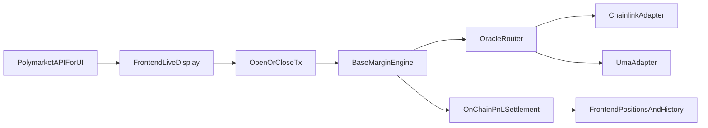

# LM Protocol - Real Onchain Demo

A minimal but real onchain prototype of the LM Protocol: leveraged prediction markets with real USDC.e money flows on **Polygon PoS** — same chain as Polymarket, with oracle-driven onchain settlement.

## Architecture

```
┌─────────────────┐      ┌──────────────────┐
│   User Wallet   │──────│   USDC.e         │
│  (MetaMask etc) │      │   (Polygon PoS)  │
└────────┬────────┘      └──────────────────┘
         │
    ┌────┴─────┐
    │          │
    ▼          ▼
┌────────┐  ┌───────────────┐     ┌──────────────┐
│ Vault  │◄─│ MarginEngine  │────▶│  Polymarket  │
│(ERC4626)│  │ (Positions)   │     │  (CLOB API)  │
│        │──│               │     │              │
│- deposit │  │- openPosition │     │ Same chain!  │
│- withdraw│  │- closePosition│     │ No bridging  │
│- lend    │  │- liquidate    │     └──────────────┘
│- repay   │  │- oracle settle│
└────────┘  └───────┬───────┘
                    │
                    ▼
              ┌──────────────┐
              │ OracleRouter │
              │ Chainlink/UMA│
              └──────────────┘
```

**Key points:**
- **Single chain**: Vault + MarginEngine + Polymarket = all on Polygon PoS
- All USDC.e transfers are **real onchain** on Polygon
- No bridging needed — deposit, borrow, trade on the same network
- Polymarket remains the **live UI** source (charts, best bid/ask)
- Onchain entry/exit/liquidation prices are **oracle-driven** via OracleRouter
- Router supports both **Chainlink adapter** and **UMA resolution adapter**

## Default market

The trade demo uses a single Polymarket binary market:

- **Question:** Will Gavin Newsom win the 2028 Democratic presidential nomination?
- **Slug:** `will-gavin-newsom-win-the-2028-democratic-presidential-nomination-568`

Live prices and charts come from the Polymarket API; onchain settlement uses the oracle layer (see Oracle + PnL Data Flow below).

## User Benefits

```
✅ No bridging needed
✅ Single chain (Polygon)
✅ Vault + Polymarket + MarginEngine = same network
✅ Instant trades, no delays
✅ Cheaper gas (Polygon vs Base + bridge)
```

## Stack

| Layer      | Technology                          |
|------------|-------------------------------------|
| Chain      | Polygon PoS mainnet (137)           |
| Token      | USDC.e (0x2791Bca1f2de4661ED88A30C99A7a9449Aa84174) |
| Contracts  | Solidity ^0.8.20, Foundry, OpenZeppelin |
| Frontend   | Next.js 14, TypeScript, Tailwind    |
| Wallet     | RainbowKit + wagmi + viem           |
| Oracle     | OracleRouter + ChainlinkBinaryAdapter + UmaResolutionAdapter |

## Quick Start

### Prerequisites

- [Foundry](https://book.getfoundry.sh/getting-started/installation) (`forge`, `cast`, `anvil`)
- [Node.js](https://nodejs.org/) >= 18
- A wallet with MATIC/POL on Polygon PoS for gas

### 1. Clone & Install

```bash
cd demo-real

# Install Foundry dependencies
cd contracts
forge install OpenZeppelin/openzeppelin-contracts --no-commit
cd ..

# Install frontend dependencies
cd frontend
npm install
cd ..
```

### 2. Deploy to Polygon

```bash
cd demo-real/contracts

# 1. Set up environment
cp polygon.env .env
# Edit .env: set PRIVATE_KEY and POLYGON_RPC_URL

# 2. Source environment
source .env

# 3. Deploy oracle + vault + margin engine to Polygon
forge script script/DeployPolygonVault.s.sol --rpc-url $POLYGON_RPC_URL --broadcast

# 4. Copy logged addresses → frontend/.env.local
# The script will output:
#   NEXT_PUBLIC_USDC_ADDRESS=0x2791Bca1f2de4661ED88A30C99A7a9449Aa84174
#   NEXT_PUBLIC_ORACLE_ROUTER_ADDRESS=0x...
#   NEXT_PUBLIC_ORACLE_CHAINLINK_ADAPTER_ADDRESS=0x...
#   NEXT_PUBLIC_ORACLE_UMA_ADAPTER_ADDRESS=0x...
#   NEXT_PUBLIC_VAULT_ADDRESS=0x...
#   NEXT_PUBLIC_MARGIN_ENGINE_ADDRESS=0x...
#   NEXT_PUBLIC_MARKET_SLUG=will-gavin-newsom-win-the-2028-democratic-presidential-nomination-568
#   NEXT_PUBLIC_MARKET_ID=0x...
```

### 3. Configure Frontend

Edit `frontend/.env.local`:

```env
NEXT_PUBLIC_WALLETCONNECT_PROJECT_ID=demo

# Polygon PoS mainnet
NEXT_PUBLIC_POLYGON_CHAIN_ID=137
NEXT_PUBLIC_POLYGON_RPC_URL=https://polygon-rpc.com
NEXT_PUBLIC_USDC_ADDRESS=0x2791Bca1f2de4661ED88A30C99A7a9449Aa84174
NEXT_PUBLIC_VAULT_ADDRESS=0x...   # from deploy output
NEXT_PUBLIC_MARGIN_ENGINE_ADDRESS=0x...   # from deploy output
NEXT_PUBLIC_CHAIN_ID=137
NEXT_PUBLIC_ORACLE_ROUTER_ADDRESS=0x...   # from deploy output
NEXT_PUBLIC_ORACLE_CHAINLINK_ADAPTER_ADDRESS=0x...   # from deploy output
NEXT_PUBLIC_ORACLE_UMA_ADAPTER_ADDRESS=0x...   # from deploy output
NEXT_PUBLIC_MARKET_SLUG=will-gavin-newsom-win-the-2028-democratic-presidential-nomination-568
NEXT_PUBLIC_MARKET_ID=0x...   # from deploy output
```

### 4. Run Frontend

```bash
cd frontend
npm run dev
```

Open [http://localhost:3000](http://localhost:3000)

### 5. Trade Flow

1. **Deposit USDC.e** into Polygon vault (`/base-vault`)
2. **Open position** → Borrow from vault → Real Polymarket trade (`/trade-demo`) — same chain!
3. **Live PnL tracking** with live Polymarket UI data + oracle-backed settlement preview
4. **Close position** → Sell on Polymarket → Onchain close uses oracle settlement price

### 6. Run tests

```bash
cd demo-real/contracts
forge test --offline
```

Covers vault deposit/withdraw, oracle-driven open/close, liquidation with oracle price, router staleness, and source switching.

## Contract Details

### Vault (BaseVault.sol)

| Feature | Details |
|---------|---------|
| Token | ERC20 shares (bUSDC) |
| Asset | USDC.e on Polygon |
| Deposit | User sends USDC.e, receives shares proportional to TVL |
| Withdraw | Burn shares, receive USDC.e (subject to available liquidity) |
| Lending | MarginEngine borrows USDC.e for leveraged positions |
| Utilization Cap | 80% max (configurable) |
| Interest Split | 88% LP / 7% Insurance / 5% Protocol |

### MarginEngine (BaseMarginEngine.sol)

| Feature | Details |
|---------|---------|
| Leverage | 2x to 5x |
| Open Fee | 0.15% of notional (30% LP / 40% Insurance / 30% Protocol) |
| Borrow APR | Kink model: base=5%, slope1=15%, slope2=60%, kink=70% |
| Maintenance Margin | 10% of notional |
| Liquidation Penalty | 1% of remaining (50% keeper / 40% insurance / 10% protocol) |
| PnL | Oracle-driven settlement (entry/exit/liquidation), real USDC.e settlement |

### Oracle Layer

| Contract | Responsibility |
|---------|----------------|
| `OracleRouter` | Per-market source routing, staleness checks, unified `getYesPriceE6` |
| `ChainlinkBinaryAdapter` | Converts Chainlink feed values to YES price (1e6 decimals); configurable per market |
| `UmaResolutionAdapter` | UMA OOV3 assertions/disputes end-to-end, or owner-fed for demo |

- **UMA (production):** Set `UMA_OOV3_ADDRESS`, `UMA_BOND_CURRENCY` (e.g. USDC.e), and `UMA_ASSERTION_LIVENESS` at deploy. Anyone can call `proposeResolution(marketId, yesPriceE6)`; after the liveness window without dispute, anyone settles on the OOV3 and the adapter receives the callback and sets the resolved price. Disputes go to UMA DVM.
- **Chainlink (production):** Set `CHAINLINK_NEWSOM_AGGREGATOR` (and optionally `CHAINLINK_NEWSOM_INVERT`, `CHAINLINK_NEWSOM_MAX_AGE_SEC`) at deploy to wire the Newsom market to a Chainlink binary feed. For other markets, use the `ConfigureOracleFeeds` script (see below).

`BaseMarginEngine` fetches YES price from `OracleRouter`, converts to position-side price (YES for long, 1-YES for short), and uses that for open snapshots and close/liquidation settlement.

### Interest Rate Model

```
if utilization <= 70%:
    rate = 5% + 15% * (utilization / 70%)
else:
    rate = 20% + 60% * ((utilization - 70%) / 30%)
```

## Frontend Pages

### / (Home)
Overview with links to Trade Demo, Polygon Vault, and Margin Trade.

### /trade-demo
- Live Polymarket data + real USDC.e vault borrowing on Polygon
- Open leveraged positions (2-5x) and trade on Polymarket — single chain
- Live position tracking with PnL, liquidation distance
- Close positions: sell on Polymarket + oracle-settled vault close — no chain switching

### /base-vault (Polygon Vault)
- Deposit/withdraw USDC.e on Polygon
- View TVL, utilization, borrowed amounts
- Insurance fund + protocol treasury

### /margin-trade
- Direct margin trading with mock prices
- Open/close positions with real USDC.e transfers

## Security Notes

This is a **prototype** for demonstration purposes:

- Contracts use ReentrancyGuard and Pausable
- No formal audit has been performed
- Not for production use with significant funds
- For production, use UMA OOV3 and/or Chainlink feeds per market (see Production Oracle Setup)

## Oracle + PnL Data Flow



## Production Oracle Setup

### UMA (end-to-end assertions/disputes)

Resolution is wired to UMA Optimistic Oracle V3 when the adapter is deployed with a non-zero OOV3 address:

1. **Deploy with UMA:** Set env and deploy:
   ```bash
   export UMA_OOV3_ADDRESS=0x...   # From https://docs.uma.xyz/resources/network-addresses (e.g. Polygon)
   export UMA_BOND_CURRENCY=0x2791Bca1f2de4661ED88A30C99A7a9449Aa84174   # USDC.e on Polygon
   export UMA_ASSERTION_LIVENESS=7200
   forge script script/DeployPolygonVault.s.sol --rpc-url $POLYGON_RPC_URL --broadcast
   ```
2. **Propose resolution:** Anyone calls `UmaResolutionAdapter.proposeResolution(marketId, yesPriceE6)` after approving the bond (USDC.e). The claim is encoded as `(marketId, yesPriceE6, blockNumber)` for disputer verification.
3. **Settle:** After the liveness window, anyone calls `OptimisticOracleV3.settleAssertion(assertionId)` on the UMA contract. The adapter receives `assertionResolvedCallback` and sets the market’s resolved price.
4. **Disputes:** Disputers call `OptimisticOracleV3.disputeAssertion(assertionId, disputer)`; resolution is arbitrated by the UMA DVM; the adapter’s callback is invoked with the final result.

Owner can still use `setResolvedPrice` for demo or emergency override when OOV3 is set.

### Chainlink (binary feeds per market)

1. **At deploy (optional):** To point the default Newsom market at a Chainlink feed:
   ```bash
   export CHAINLINK_NEWSOM_AGGREGATOR=0x...   # Chainlink aggregator for binary outcome
   export CHAINLINK_NEWSOM_INVERT=false       # Set true if feed is NO-not-YES
   export CHAINLINK_NEWSOM_MAX_AGE_SEC=3600
   forge script script/DeployPolygonVault.s.sol --rpc-url $POLYGON_RPC_URL --broadcast
   ```
2. **After deploy (any market):** Use the config script (one market per run):
   ```bash
   export ORACLE_ROUTER_ADDRESS=0x...
   export CHAINLINK_ADAPTER_ADDRESS=0x...
   export MARKET_SLUG=will-gavin-newsom-win-the-2028-democratic-presidential-nomination-568
   export CHAINLINK_AGGREGATOR=0x...
   export CHAINLINK_MAX_AGE_SEC=3600
   forge script script/ConfigureOracleFeeds.s.sol:ConfigureOracleFeeds --rpc-url $POLYGON_RPC_URL --broadcast
   ```
   For raw `bytes32` market id, set `MARKET_ID` instead of `MARKET_SLUG`. Repeat with different `MARKET_SLUG`/`CHAINLINK_AGGREGATOR` for additional markets.

## Next Steps (Production)

1. ~~Wire UMA assertions/disputes end-to-end~~ ✅ (see Production Oracle Setup)
2. ~~Configure production Chainlink binary feeds per market in router~~ ✅ (see Production Oracle Setup)
3. Formal security audit
4. Timelock on admin functions
5. Keeper bot for liquidations
6. Subgraph for position indexing
